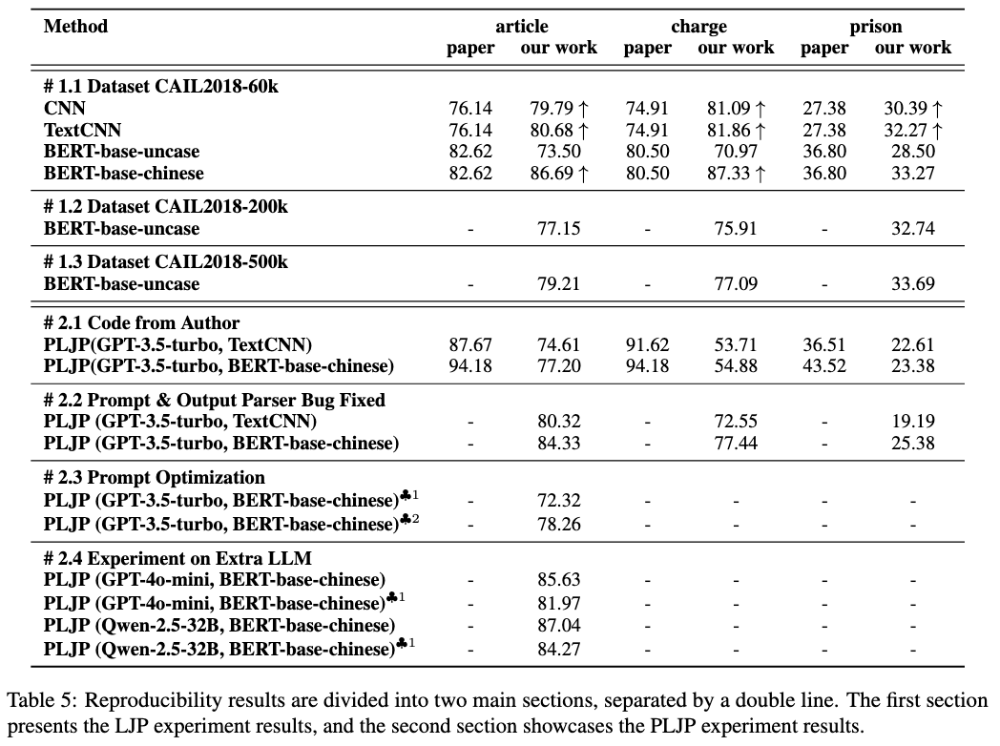

# PLJP Reproduction

This is a reproduction repo: 
- Paper: 2023-EMNLP-Precedent-Enhanced Legal Judgment Prediction with LLM and Domain-Model Collaboration
- Original repo: https://github.com/wuyiquan/PLJP
- Contribution:
  - Completed the missing code, including predictive module and retrieval module;
  - Fix bugs, including prompt inconsistency and LLM output parsing;
  - Extra exploration, including CoT prompt optimization and Qwen-2.5-32B experiments;


## Dependecy:

**Hardware**

- CPU: Intel Xeon Gold;
- GPU: A40(48G);
- Memory: 64G;

**Python Library**

- Python == 3.9.20;
- Pytorch == 2.4.1;
- Transformer == 4.46.0;


## Usage

### Datasets

Follow instructions from the [origin repo](https://github.com/wuyiquan/PLJP), download CAIL2018 and CJO2022 dataset.

- CAIL2018 can be downloaded [here](https://pan.baidu.com/s/1MrJdxvwTOfwhOwANJpTLtQ). Extraction code: vu76
- CJO2022 can be downloaded [here](https://github.com/china-ai-law-challenge/CAIL2018)

**Step 1: dataset partitioning**

```bash
cd data
python dataset.py
```

### Predictive Model

**Step 2: LJP model training and inference**

```bash
# BERT
cd data/predictive_model
python run_bert.py --run_train
python run_bert.py --run_infer
```

```bash
# CNN
cd data/predictive_model
python run_cnn.py --run_train --model_name CNN
python run_cnn.py --run_infer --model_name CNN

# TextCNN
cd data/predictive_model
python run_cnn.py --run_train --model_name TextCNN
python run_cnn.py --run_infer --model_name TextCNN
```

### Retrieval Model

**Step 3: Precedent retrival**

```bash
# Contriever
cd data/predictive_model
python run_contriever.py
```

### LLM Generation

**Step 4.1: Config API key**

**OpenAI API key (For GPT-series)**: llm_api.py/ln.24
```python
...
key_pool = [
    ""
]
...
```

**Siliconflow API key (For Qwen-2.5-32B)**: llm_api.py/qwen_response/ln.81

```python
...
siliconflow_key = ""
headers = {
    "Authorization": f"Bearer {siliconflow_key}",
    "Content-Type": "application/json"
}
...
```

**Step 4.2: PLJP generation with LLM**

```bash
sh run.sh
```

### Prompt Optimization

Different prompt optimization configuration is in directory `mycode/utils/prompt_gen*.py`
You can activate different prompt setting by importing them in `llm_api.py`

```python
# llm_api.py

from mycode.utils import prompt_gen as prompt_gen
# from mycode.utils import prompt_gen2 as prompt_gen
# from mycode.utils import prompt_gen3 as prompt_gen
# from mycode.utils import prompt_gen4 as prompt_gen
# from mycode.utils import prompt_gen5 as prompt_gen

```

## Reproduction Results


